# VoiceNote FPGA（PL）仕様書

## 1. 概要

本ドキュメントは、VoiceNoteシステムにおけるFPGA（PL）側の構成および仕様をまとめたものである。

PLは主に**音声データの入出力およびリアルタイム処理**を担当し、
PS（ARM Cortex-A9）からの制御により、録音・再生・音声加工を行う。

## 2. 機能一覧

FPGA（PL）側で提供する主な機能を以下に示す。

| 大項目 | 中項目 | 小項目 | 内容 |
|:---:|:---:|:---:|:---:|
| 音声入出力 | 音声入力 | I2S受信 | SSM2603（ADC）からI2Sにより音声データを受信 |
|  |  | AXI4-Stream変換 | I2Sの入力データをAXI4-Stream形式へ変換して後段へ出力 |
|  | 音声出力 | AXI4-Stream受信 | 後段のAXI4-Stream音声データを受信して再生経路へ渡す |
|  |  | I2S送信 | SSM2603（DAC）向けにI2S信号を生成して再生音声を出力 |
|  | クロック | 音声クロック切替 | 必要に応じて音声クロック源を切り替える |
| 音声転送 | DMA転送 | S2MM | 録音音声をDDRへ書き込み |
|  |  | MM2S | 再生音声をDDRから読み出し |
|  |  | フォーマット変換 | Audio Formatterにより音声ストリームとメモリ転送フォーマットを接続 |
| 音声処理 | AREC | 音量監視 | 入力音声の平均絶対値を監視し、しきい値超過を検出する |
|  |  | プリトリガ保存 | トリガ前の音声データをBRAMへ保存する |
|  |  | ダンプ出力 | トリガ成立後にBRAM内のプリトリガデータをAXI4-Streamで出力する |
|  | ACU | DCカット | 録音音声のDC成分を除去する |
|  |  | ノイズゲート | 小信号を抑圧し、無音時ノイズを低減する |
|  | AGC | UART受信 | dToFセンサーから距離データをUARTで受信する |
|  |  | 距離 - ゲイン変換 | 距離値をLUTにより目標ゲインへ変換する |
|  |  | IIR平滑化 | 目標ゲインの変化を平滑化して急峻な音量変化を抑える |
|  |  | ゲイン反映 | 平滑化したゲインを音声ストリームへ乗算して反映する |
| 外部制御 | 通信 | Audio Codec制御I2C | Audio Codecの初期設定および制御を行う |
|  |  | タッチ制御I2C | タッチパネルとの制御通信を行う |
|  | 入出力 | GPIO入力 | ボタン、外部GPIO入力を PS ⇔ PL で参照可能にする |
|  |  | GPIO出力 | LED、外部GPIO出力を制御する |

---

## 3. システム構成
### 3-1. 全体構成

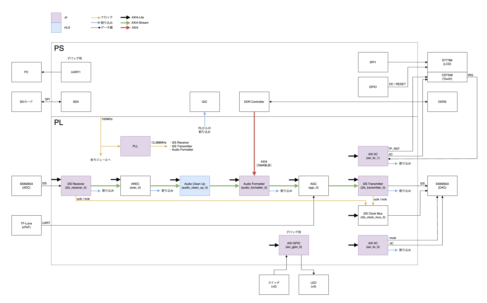

PL内で使用する主要モジュールを以下に示す。

| モジュール名 | 種別 | 役割 |
|---|---|---|
| I2S Receiver | AMD IP | Audio Codecからの録音データを受信し、AXI4-Streamへ変換する |
| I2S Transmitter | AMD IP | AXI4-Streamの再生データをAudio Codec向けI2S信号へ変換する |
| I2S Clock MUX | カスタムIP | I2Sのオーディオクロックの切り替えを行う |
| Audio Formatter | AMD IP | 音声ストリームとDDRメモリ間のデータ転送および音声フォーマット処理を行う |
| AREC | カスタムIP | 音量監視、プリトリガ保存、トリガ後のダンプ出力を行う自動録音制御回路 |
| ACU | HLS | DCカット、ノイズゲートの音声前処理を行う |
| AGC | カスタムIP | UARTで取得した距離情報を用いてゲイン調整、平滑化、AGC反映を行う |
| AXI GPIO | AMD IP | LED、ボタン、外部GPIOの入出力を制御する |
| AXI IIC | AMD IP | Audio Codec およびタッチパネルとの I2C 通信を行う |

### 3-2. クロック

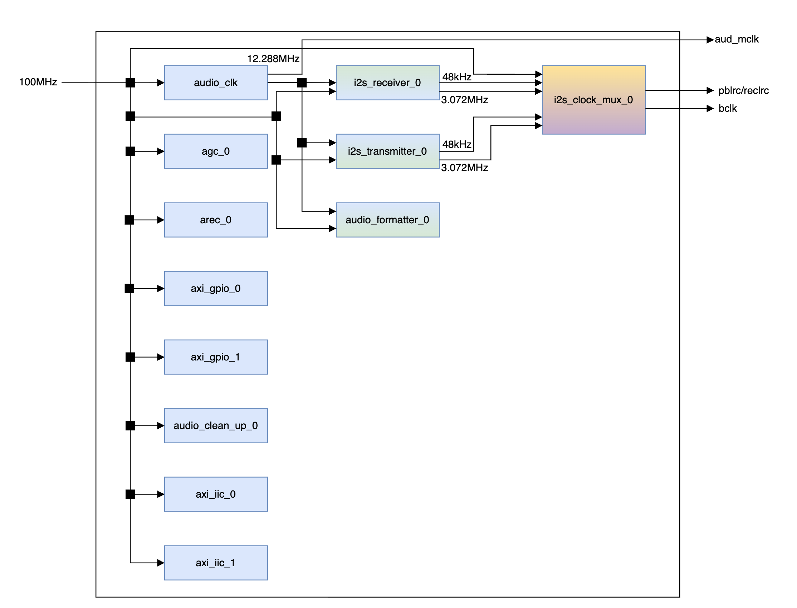

### 3-3. リセット

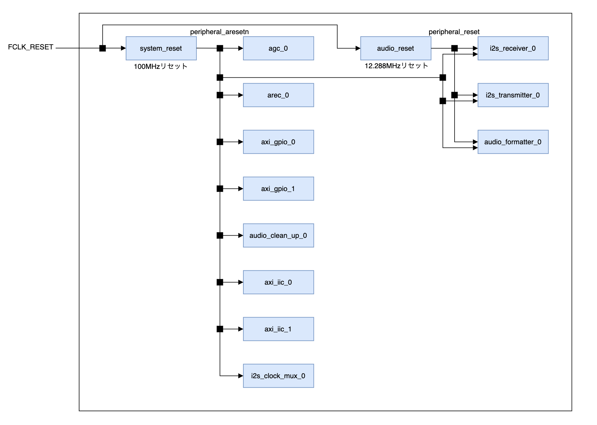

### 3-4. バス接続

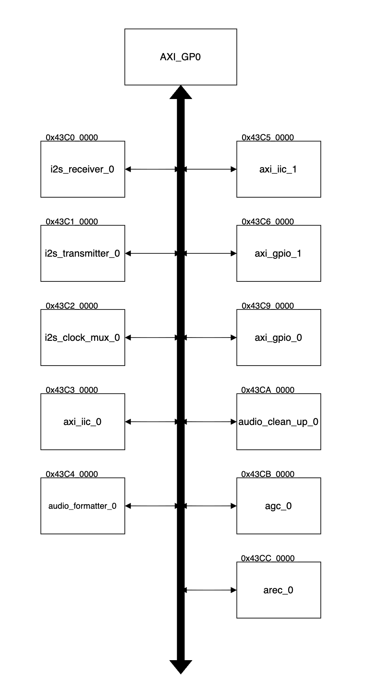

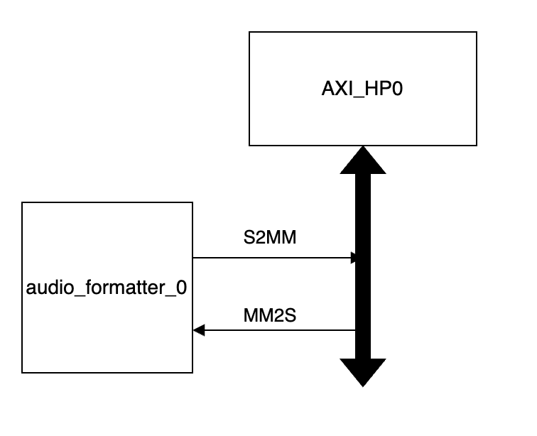

---

## 4. インターフェース

### 4-1. 内部インターフェース（PS ⇔ PL）

| インターフェース | 規格 | 周波数 | 用途 |
|:---:|:---:|:---:|:---:|
| 制御バス | AXI4-Lite | 100MHz | レジスタ制御 |
| データバス | AXI4 | 100MHz | DMA転送 |
| 音声ストリーム | AXI4-Stream | 100MHz | 音声データ処理 |

### 4-2. 外部インターフェース

| デバイス | 信号 | インターフェース | 方向 | 周波数 | 用途 |
|:---:|:---:|:---:|:---:|:---:|:---:|
| Audio Codec | `aud_mclk` | I2S Clock | PL→外部 | 12.288MHz | Audio MCLK供給 |
| Audio Codec | `bclk` | I2S Clock | PL→外部 | 3.072MHz | I2Sビットクロック |
| Audio Codec | `pblrc` | I2S LRCLK（再生） | PL→外部 | 48kHz | 再生チャネル同期 |
| Audio Codec | `reclrc` | I2S LRCLK（録音） | PL→外部 | 48kHz | 録音チャネル同期 |
| Audio Codec | `sdata_out` | I2S Data | PL→外部 | `bclk`/`lrclk`同期 | 再生データ出力 |
| Audio Codec | `sdata_in` | I2S Data | 外部→PL | `bclk`/`lrclk`同期 | 録音データ入力 |
| Audio Codec | `IIC_0_scl_io`, `IIC_0_sda_io` | I2C | 双方向 | 100kHz | Audio Codec設定 |
| Audio Codec | `mute` | GPIO | PL→外部 | - | Codec Mute制御 |
| dToFセンサー | `rx` | UART | 外部→PL | 115.2Kbps | 距離データ受信 |
| タッチパネル | `IIC_1_scl_io`, `IIC_1_sda_io` | I2C | 双方向 | 100kHz | タッチ制御通信 |
| タッチパネル | `tp_rst` | GPIO | PL→外部 | - | タッチリセット制御 |

### 4-3. AXI4-Streamデータフォーマット

本設計の音声ストリームは、AES/IEC 60958 のサブフレーム情報（`P/C/U/V` と preamble）を保持した32bitデータとして扱う。
以下に、PL内で共通使用するAXI4-Streamフォーマットを示す。

| Bit | 信号 | 説明 |
|---|---|---|
| 31 | `P` | Parity |
| 30 | `C` | Channel Status |
| 29 | `U` | User Data |
| 28 | `V` | Validity |
| 27:4 | `audio_sample_word[23:0]` | Audio Sample word |
| 3:0 | `preamble` | サブフレーム preamble |

補足:
- `preamble` は以下のコードを使用する
  - `4'b0001` : Start of Audio Block / Channel 0 audio sample
  - `4'b0010` : Channel 0/2/4/6 audio data（Left Audio Data）
  - `4'b0011` : Channel 1/3/5/7 audio data（Right Audio Data）
- `tid[2:0]` はチャネルIDとして使用する
  - `0/2/4/6` : Left Audio Data
  - `1/3/5/7` : Right Audio Data
- 本設計の AGC / AREC は、`audio_sample_word[23:0]` のうち `tdata[27:12]` を16bit符号付きサンプルとして使用する
- AGC では `P/C/U/V` と `preamble` を保持したまま `tdata[27:12]` にゲインを適用する

#### 4-3-1. AREC内部保存形式（36bit）

ARECでは、AXI4-Stream データを BRAM に保存するために、以下の内部形式へパックする。

| ビット | 内容 |
|---|---|
| `[35:33]` | `tid[2:0]` |
| `[32:1]` | `tdata[31:0]` |
| `[0]` | 予約（`0`固定） |

---

## 5. 端子表

Zynq デバイスの外部端子を以下に示す。

| 信号名 | 方向 | 機能 | PACKAGE_PIN | IOSTANDARD | 備考 |
|---|---|---|---|---|---|
| aud_mclk | O | Audio MCLK | R17 | LVCMOS33 | Codec |
| bclk | O | I2S BCLK | R19 | LVCMOS33 | Codec |
| pblrc | O | I2S LRCLK（再生） | T19 | LVCMOS33 | Codec |
| reclrc | O | I2S LRCLK（録音） | Y18 | LVCMOS33 | Codec |
| sdata_out | O | I2S Data Out | R18 | LVCMOS33 | Codec |
| sdata_in | I | I2S Data In | R16 | LVCMOS33 | Codec |
| mute | O | Codec Mute | P18 | LVCMOS33 | Codec |
| IIC_0_scl_io | I/O | I2C SCL | N18 | LVCMOS33 | Pull-up |
| IIC_0_sda_io | I/O | I2C SDA | N17 | LVCMOS33 | Pull-up |
| IIC_1_scl_io | I/O | I2C SCL | V12 | LVCMOS33 | Pull-up |
| IIC_1_sda_io | I/O | I2C SDA | W16 | LVCMOS33 | Pull-up |
| tp_rst | O | Touch Reset | J15 | LVCMOS33 |  |
| rx | I | UART RX | H15 | LVCMOS33 | dToF |
| btns[0] | I | Button | K18 | LVCMOS33 |  |
| btns[1] | I | Button | P16 | LVCMOS33 |  |
| btns[2] | I | Button | K19 | LVCMOS33 |  |
| btns[3] | I | Button | Y16 | LVCMOS33 |  |
| leds[0] | O | LED | M14 | LVCMOS33 |  |
| leds[1] | O | LED | M15 | LVCMOS33 |  |
| leds[2] | O | LED | G14 | LVCMOS33 |  |
| leds[3] | O | LED | D18 | LVCMOS33 |  |
| GPIO_0[0] | I | GPIO In | V13 | LVCMOS33 |  |
| GPIO_0[1] | I | GPIO In | U17 | LVCMOS33 |  |
| GPIO2_0[0] | O | GPIO Out | T17 | LVCMOS33 |  |
| GPIO2_0[1] | O | GPIO Out | Y17 | LVCMOS33 |  |

---

## 6. レジスタマップ

PLで扱っているレジスタマップ一覧を示す。

| モジュール | Base | Offset | レジスタ名 |
|---|---|---|---|
| I2S Receiver | `0x43C0_0000` |  | AMD IPのため省略 |
| I2S Transmitter | `0x43C1_0000` |  | AMD IPのため省略 |
| I2S Clock MUX | `0x43C2_0000` | `0x00` | SELECT_CLK：I2S受信/送信クロック制御 |
| AXI IIC 0 | `0x43C3_0000` |  | AMD IPのため省略 |
| Audio Formatter | `0x43C4_0000` |  | AMD IPのため省略 |
| AXI IIC 1 | `0x43C5_0000` |  | AMD IPのため省略 |
| AXI GPIO 1 | `0x43C6_0000` |  | AMD IPのため省略 |
| AXI GPIO 0 | `0x43C9_0000` |  | AMD IPのため省略 |
| ACU | `0x43CA_0000` | `0x00` | ACU CONTROL：ACUの動作制御 |
|  |  | `0x04` | GIE：グローバル割り込み許可 |
|  |  | `0x08` | IER：割り込み要因ごとの許可設定 |
|  |  | `0x0C` | ISR：割り込み状態 |
|  |  | `0x10` | DC_A_COEF：DCカットのフィルタ係数a |
|  |  | `0x18` | DC_PASS：DCカットのバイパス設定 |
|  |  | `0x20` | TH_OPEN_AMP：ノイズゲート開放しきい値（下位） |
|  |  | `0x24` | TH_OPEN_AMP：ノイズゲート開放しきい値（上位） |
|  |  | `0x2C` | TH_CLOSE_AMP：ノイズゲート閉鎖しきい値（下位） |
|  |  | `0x30` | TH_CLOSE_AMP：ノイズゲート閉鎖しきい値（上位） |
|  |  | `0x38` | A_ATTACK：ゲインAのアタック係数 |
|  |  | `0x40` | A_RELEASE：ゲインAのリリース係数 |
|  |  | `0x48` | B_ATTACK：ゲインBのアタック係数 |
|  |  | `0x50` | B_RELEASE：ゲインBのリリース係数 |
|  |  | `0x58` | NG_PASS：ノイズゲートのバイパス設定 |
| AGC | `0x43CB_0000` | `0x00` | AGC CONTROL：AGCの動作制御 |
|  |  | `0x04` | STATUS：AGCのステータス |
|  |  | `0x08` | DIST_RAW_MM：dToFセンサーから取得した生距離[mm] |
|  |  | `0x0C` | DIST_CLAMP_MM：補正後の距離[mm] |
|  |  | `0x10` | DIST_SENSITIVITY：距離変化の検出しきい値[mm] |
|  |  | `0x14` | MANUAL_GAIN：手動ゲイン設定値 |
|  |  | `0x18` | GAIN_TARGET：目標ゲイン |
|  |  | `0x1C` | GAIN_SMOOTH：平滑化後の適用ゲイン |
|  |  | `0x20` | GAIN_MIN：ゲイン下限値 |
|  |  | `0x24` | GAIN_MAX：ゲイン上限値 |
|  |  | `0x28` | ALPHA_CONFIG：ゲイン平滑化係数設定 |
| AREC | `0x43CC_0000` | `0x00` | AREC CONTROL：ARECの動作制御 |
|  |  | `0x04` | STATUS：ARECのステータス |
|  |  | `0x10` | THRESHOLD：録音開始トリガしきい値 |
|  |  | `0x14` | WINDOW_SAMPLES：判定窓長設定 |
|  |  | `0x18` | PRETRIG_SAMPLES：プリトリガ保持サンプル数 |
|  |  | `0x1C` | REQUIRED_WINDOWS：トリガ成立に必要な連続窓数 |

---

## 7. 割り込み一覧

PS ⇔ PL間の割り込みは `xlconcat_0` で束ねており、`IRQ[0]` から `IRQ[8]` を使用する。

| IRQ番号 | xlconcat入力 | 割り込み名 | 発生元IP | 発生条件（概要） | クリア方法（概要） |
|---|---|---|---|---|---|
| 61 | In0 | I2S_RX_IRQ | I2S Receiver | RX側イベント発生時（IP仕様準拠） | I2S Receiver制御レジスタでクリア |
| 62 | In1 | I2S_TX_IRQ | I2S Transmitter | TX側イベント発生時（IP仕様準拠） | I2S Transmitter制御レジスタでクリア |
| 63 | In2 | AUDIO_FMT_MM2S_IRQ | Audio Formatter | MM2S側イベント発生時（IP仕様準拠） | Audio Formatter制御レジスタでクリア |
| 64 | In3 | AUDIO_FMT_S2MM_IRQ | Audio Formatter | S2MM側イベント発生時（IP仕様準拠） | Audio Formatter制御レジスタでクリア |
| 65 | In4 | AXI_IIC0_IRQ | AXI IIC 0 | I2Cイベント発生時（IP仕様準拠） | AXI IICステータス操作でクリア |
| 66 | In5 | AXI_GPIO0_IRQ | AXI GPIO 0 | GPIO割り込み条件成立時（IP仕様準拠） | AXI GPIO割り込みレジスタでクリア |
| 67 | In6 | AXI_IIC1_IRQ | AXI IIC 1 | I2Cイベント発生時（IP仕様準拠） | AXI IICステータス操作でクリア |
| 68 | In7 | AXI_GPIO1_IRQ | AXI GPIO 1 | GPIO割り込み条件成立時（IP仕様準拠） | AXI GPIO割り込みレジスタでクリア |
| 84 | In8 | AREC_DUMP_IRQ | AREC | DUMP遷移条件成立時にアサート | `CONTROL[1]` (`irq_clear`) 書き込み |

補足:
- Zynq PSのPL割り込みは最大16本（`IRQ[15:0]`）を扱えるが、本設計で接続しているのは上表の9本のみ。

---

## 8. 各モジュールの詳細

ACUの説明は高位合成の別途資料に記載。

### 8-1. I2S Receiver IP

- 種別：AMD I2S Receiver
- 設定

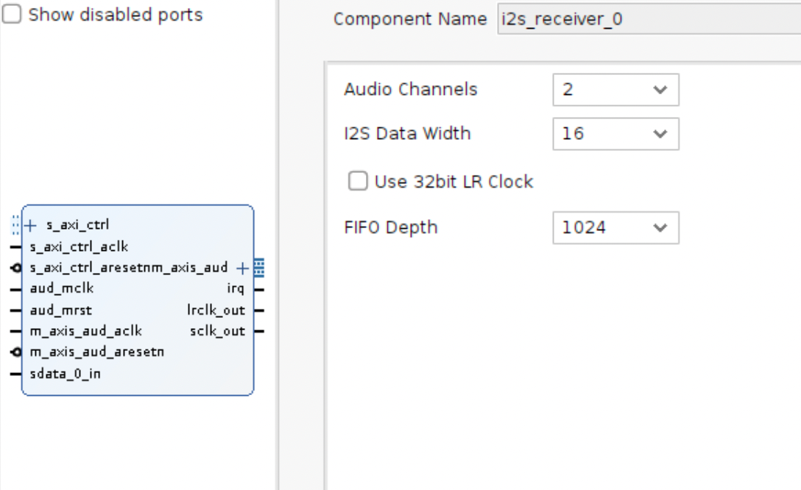

---

### 8-2. I2S Transmitter IP

- 種別：AMD I2S Transmitter
- 設定

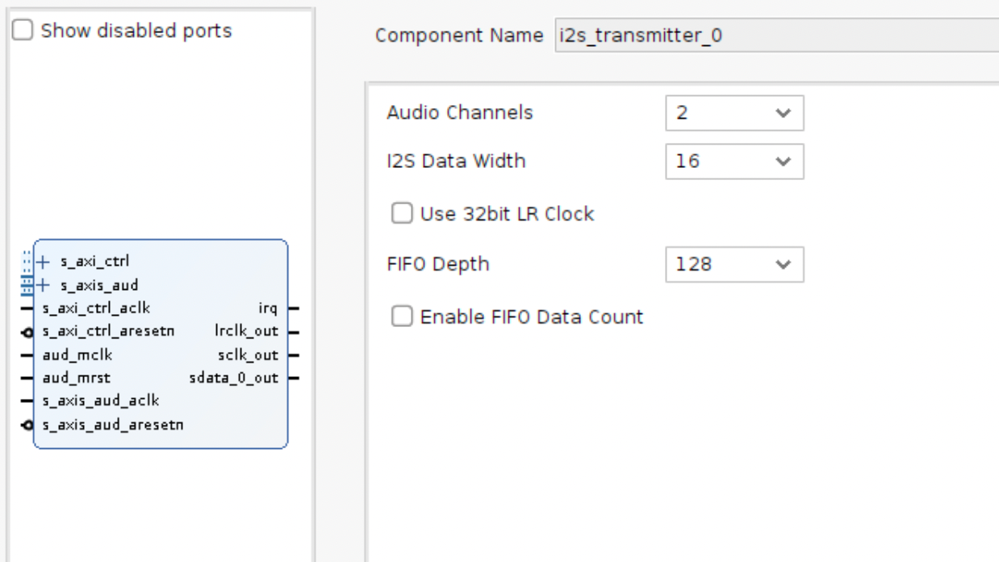

---

### 8-3. Audio Formatter IP

- 種別：AMD Audio Formatter
- 設定

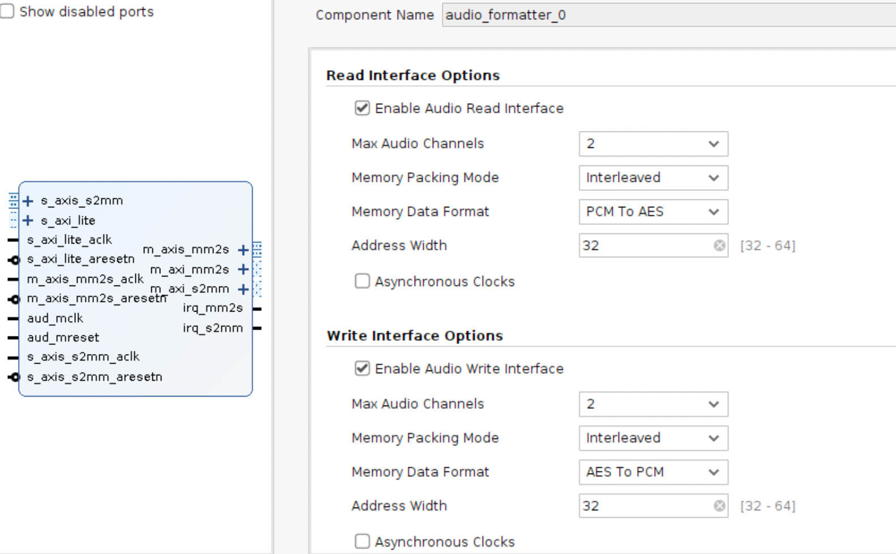

---

### 8-4. AXI GPIO IP

- 種別：AMD AXI GPIO 0
- 設定

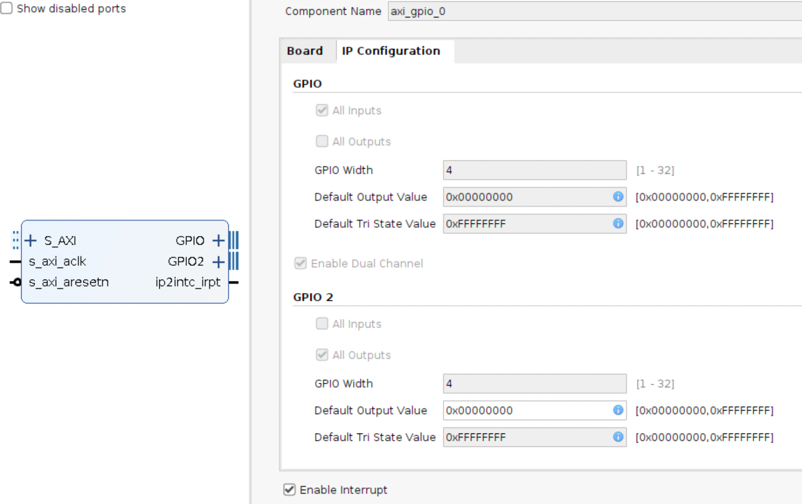

- 種別：AMD AXI GPIO 1
- 設定

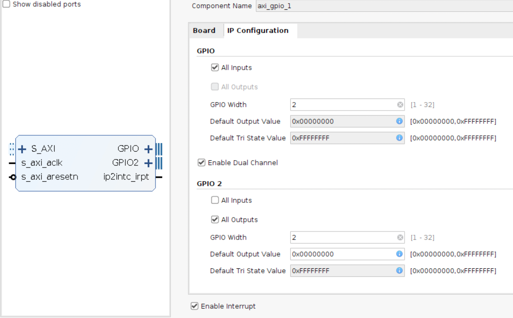


---

### 8-5. AXI IIC IP

- 種別：AMD AXI IIC 0
- 設定

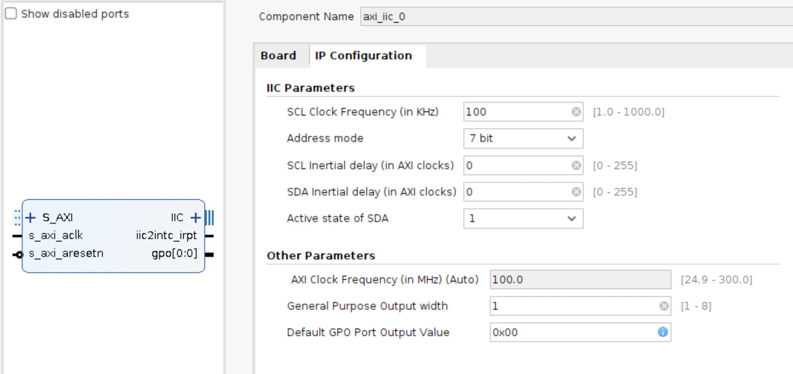

- 種別：AMD AXI IIC 1
- 設定

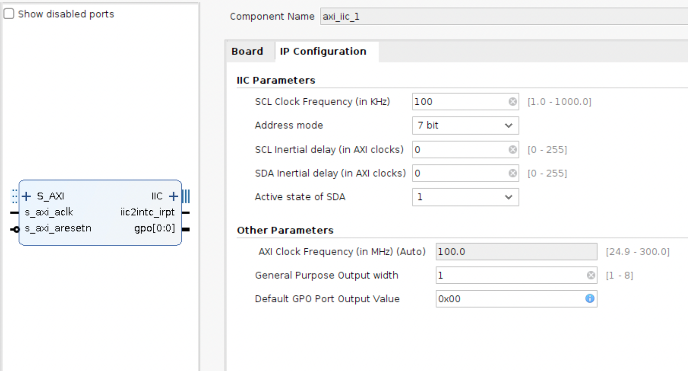

### 8-6. Clocking Wizard IP

- 種別：AMD Clocking Wizard
- 設定

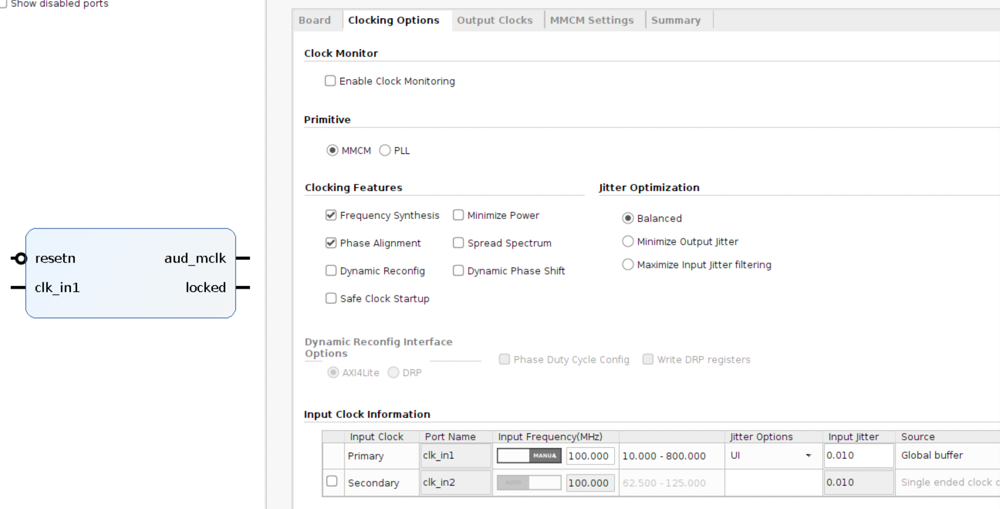

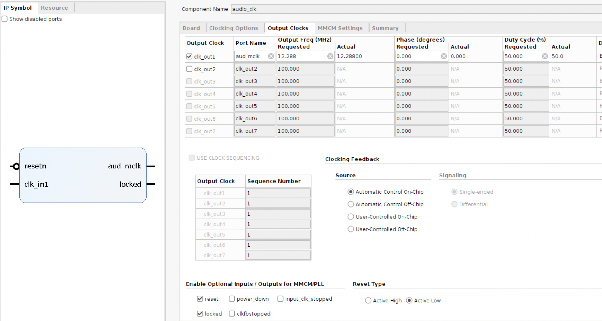

---

### 8-7. I2S Clock MUX

#### 8-7-1. 概要
I2S Clock MUXは、I2S IPの受信側と送信側のLRCLK/BCLKの切り替えを制御する機能である。

- 機能
  - I2Sの受信側/送信側のLRCLK/BCLK切り替え

---

### 8-8. AGC

#### 8-8-1. 概要
AGCは、dToFセンサーからUARTで取得した距離情報をもとに、再生音声のゲインを自動調整する機能である。

機能:
1. UART距離受信 & フレーム解析
2. 距離値のクランプと変化量判定
3. LUTによる距離 - ゲイン変換
4. IIRによるゲイン平滑化
5. 音声ストリームへのゲイン乗算

#### 8-8-2. 構成
AGCを構成するモジュールと、各モジュールの役割を示す。

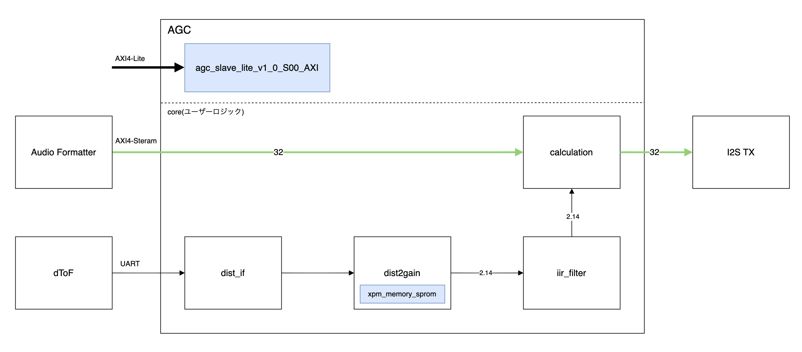

| モジュール名 | 区分 | 役割 |
|---|---|---|
| agc.v | Vivado自動生成ベース | AXI4-LiteラッパおよびAXI4-Stream入出力のTOP |
| agc_slave_lite_v1_0_S00_AXI.v | Vivado自動生成ベース | AXI4-Liteのレジスタ制御 |
| core.v | ユーザー実装 | メイン制御のTOP |
| dist_if.v | ユーザー実装 | UART受信と距離フレーム抽出のTOP |
| uart_rx.v | ユーザー実装 | UART受信 |
| frame_parser.v | ユーザー実装 | dToFセンサーのフレームヘッダ検出、チェックサム確認、距離値抽出 |
| dist2gain.v | ユーザー実装 | 距離のクランプ、変化量判定、LUT参照 |
| iir_filter.v | ユーザー実装 | 目標ゲインの平滑化と上下限制限 |
| calculation.v | ユーザー実装 | 音声サンプルへのゲイン乗算と飽和処理 |

#### 8-8-3. 機能詳細
##### 8-8-3-1. UART距離受信 & フレーム解析
dToFセンサーからの測距データの受信とフレームの解析を行う。

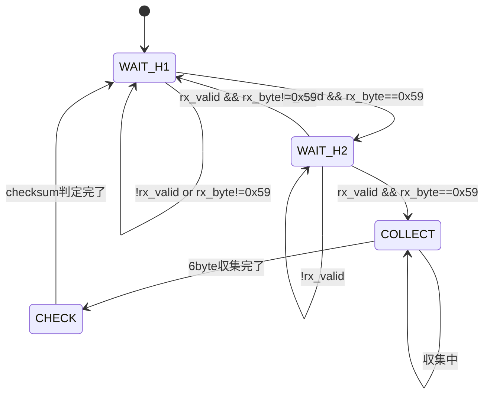
```mermaid
stateDiagram-v2
    [*] --> WAIT_H1
    WAIT_H1 --> WAIT_H1: !rx_valid or rx_byte!=0x59
    WAIT_H1 --> WAIT_H2: rx_valid && rx_byte==0x59
    WAIT_H2 --> WAIT_H1: rx_valid && rx_byte!=0x59
    WAIT_H2 --> WAIT_H2: !rx_valid
    WAIT_H2 --> COLLECT: rx_valid && rx_byte==0x59
    COLLECT --> COLLECT: 収集中
    COLLECT --> CHECK: 6byte収集完了
    CHECK --> WAIT_H1: checksum判定完了
```

| 状態 | 説明 |
|---|---|
| WAIT_H1 | 1バイト目のヘッダ `0x59` を待つ |
| WAIT_H2 | 2バイト目のヘッダ `0x59` を待つ |
| COLLECT | 続く6バイトのデータ部を収集する |
| CHECK | チェックサムを照合し、正常時のみ距離値を出力する |

受信処理の流れ:
1. `WAIT_H1` / `WAIT_H2` でdToFセンサーのフレームヘッダ `0x59 0x59` を検出する
2. `COLLECT` で後続6バイトを取り込み、チェックサム計算値を更新する
3. `CHECK` で受信したチェックサムと比較し、一致時のみ `dist_valid=1` を1クロック出力する
4. 距離値は `r_buf[1:0]` から `dist_mm` として取り出す
5. チェックサム不一致時は `pkt_error=1` を1クロック出力する

dToFセンサー動作監視:
- 正常な距離フレームを受信すると `tof_working=1` になる
- 100ms 相当（100MHz動作で `10_000_000` クロック）距離更新が無い場合、`tof_working=0` に戻る
- UARTのフレーミング異常は `uart_rx` から `frame_error` として通知される

##### 8-8-3-2. 距離 - ゲイン変換
受信した距離値をクランプ・量子化してLUTアドレスへ変換し、目標ゲインを生成する。

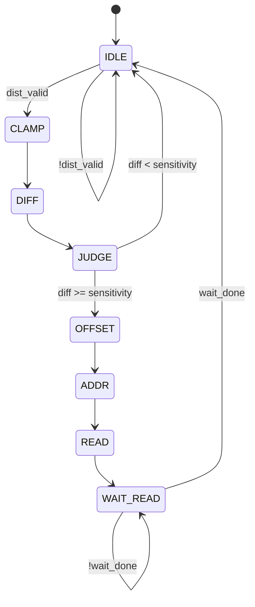
```mermaid
stateDiagram-v2
    [*] --> IDLE
    IDLE --> IDLE: !dist_valid
    IDLE --> CLAMP: dist_valid
    CLAMP --> DIFF
    DIFF --> JUDGE
    JUDGE --> IDLE: diff < sensitivity
    JUDGE --> OFFSET: diff >= sensitivity
    OFFSET --> ADDR
    ADDR --> READ
    READ --> WAIT_READ
    WAIT_READ --> WAIT_READ: !wait_done
    WAIT_READ --> IDLE: wait_done
```

| 状態 | 説明 |
|---|---|
| IDLE | 新しい距離データを待つ |
| CLAMP | 距離値を対応範囲へ丸める |
| DIFF | 前回採用距離との差分を計算する |
| JUDGE | 感度しきい値以上の変化か判定する |
| OFFSET | 最小距離基準へオフセット変換する |
| ADDR | LUTアドレスを生成し、読み出しを開始する |
| READ | LUT読み出し要求を発行する |
| WAIT_READ | LUTの読み出しレイテンシを待つ |

変換処理の流れ:
1. 生の距離値 `dist_data` を `dist_raw_mm` に保持する
2. 距離値を200mm以上3000mm以下にクランプし、`dist_clamp_mm` とする
3. `pre_dist` との差分絶対値 `dist_diff` を計算する
4. `dist_diff >= dist_sensitivity_reg[15:0]` のときのみ、新しい距離を採用する
5. 採用時は `offset = dist_clamp_mm - 200`、`addr = offset >> 5` を計算し、32mm刻みのLUTを参照する
6. LUT読み出し完了時に `gain_valid=1` を1クロック出力し、目標ゲイン `gain_data` を `iir_filter` に渡す

距離変換仕様:
- 対応距離範囲は200mmから3000mm
- LUT深さは88
- アドレス刻みは32mm
- LUTデータ形式はQ2.14固定小数点
- LUTファイルは `gain_lut.mem`

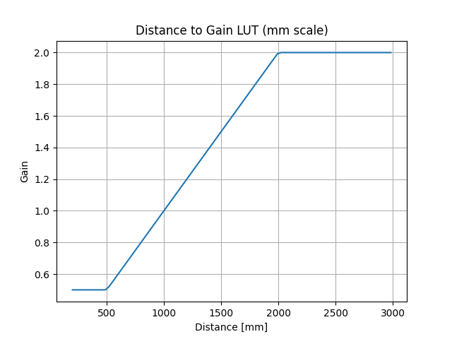

距離からLUTアドレスへの変換:
- クランプ後距離 `dist_clamp_mm` から最小距離200mmを引き、`offset_mm` を求める
- `offset_mm` を32mm単位へ量子化するため、`addr = offset_mm >> 5` とする
- これは $a=\left\lfloor \frac{d_{\mathrm{clip}}-200}{32} \right\rfloor$ と等価である
- したがって、LUTの各エントリは32mm幅の距離区間を表す

数式:

```math
d_{\mathrm{raw}}[n] : \text{受信した距離 [mm]}
```

```math
d_{\mathrm{clip}}[n] = \min\left(\max\left(d_{\mathrm{raw}}[n], 200\right), 3000\right)
```

```math
o[n] = d_{\mathrm{clip}}[n] - 200
```

```math
a[n] = \left\lfloor \frac{o[n]}{32} \right\rfloor
```

よって、LUTアドレスは次式で表せる。

```math
a[n] = \left\lfloor \frac{\min\left(\max\left(d_{\mathrm{raw}}[n], 200\right), 3000\right)-200}{32} \right\rfloor,\quad a[n]\in[0,87]
```

> [!NOTE]
> 分解能を32mmにしている理由
> 1. LUTサイズの最適化\
> (3000 - 200) / 32 ≒ 88となり、BRAMサイズを小さく抑えつつ、十分な分解能を確保できるため。
> 2. ハードウェア効率の向上\
> シフト演算のみでアドレス生成できるため、除算回路が不要となり、回路規模および遅延を低減できるため。
> 3. センサ特性との整合\
> センサの測距精度（数cm）に対して過剰な分解能を持たせても有効性が低いため。

##### 8-8-3-3. ゲイン平滑化
距離から得た目標ゲインを一次IIRで平滑化し、急峻な音量変化を抑える。

使用しているIIR:
- 一次IIRフィルタ（指数移動平均型、single-pole low-pass）
- 入力 `target_gain` に対して、出力 `gain_smooth` を離散時間で逐次更新する

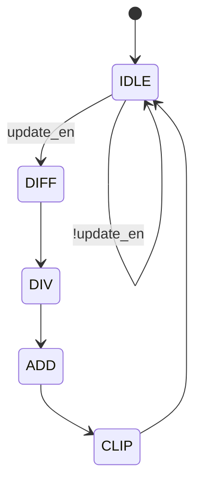
```mermaid
stateDiagram-v2
    [*] --> IDLE
    IDLE --> IDLE: !update_en
    IDLE --> DIFF: update_en
    DIFF --> DIV
    DIV --> ADD
    ADD --> CLIP
    CLIP --> IDLE
```

| 状態 | 説明 |
|---|---|
| IDLE | 新しい目標ゲインを待つ |
| DIFF | `target_gain - current_gain` を計算する |
| DIV | 実効αに応じて算術右シフトし、更新量を求める |
| ADD | 現在ゲインへ更新量を加算する |
| CLIP | 上下限クリップを適用し、次回値を確定する |

平滑化処理:
1. 初期ゲインは `1.0`（Q2.14で `0x4000`）とする
2. `update_en=1` で `target_gain - r_gain_smooth` を計算する
3. 実効α `w_alpha` に応じて `r_diff >>> w_alpha` を求める
4. `r_gain_smooth + r_step` を次回ゲイン候補とする
5. `gain_min_reg` / `gain_max_reg` の範囲に収まるようクリップして `smooth_gain` を更新する

IIRの更新式:

```math
\mathrm{diff} = t - g
```

```math
\mathrm{step} = \frac{\mathrm{diff}}{2^k}
```

```math
g_{\mathrm{next}} = g + \mathrm{step}
```

ここで `k` は `ALPHA_CONFIG` から選ばれる実効係数であり、実装では算術右シフト `diff >>> k` により除算を行う。

通常の表記では以下と等価である。

```math
g_{\mathrm{next}} = g + \frac{t-g}{2^k}
```

離散時間インデックスで書くと次式である。

```math
g[n+1] = g[n] + \frac{t[n]-g[n]}{2^k}
       = \left(1-\frac{1}{2^k}\right)g[n] + \frac{1}{2^k}t[n]
```

ここで:
- `g[n]` : `n` 回目更新時の平滑化ゲイン
- `t[n]` : `n` 回目更新時の目標ゲイン
- `k` : 実効係数（`ALPHA_CONFIG` から選択）

したがって、`k` が小さいほど目標ゲインへの追従は速く、`k` が大きいほど変化は緩やかになる。

`alpha_config_reg` の扱い:
- bit[3:0] : 通常時 α
- bit[7:4] : ゲイン上昇時 α
- bit[11:8] : ゲイン下降時 α
- 各フィールドは `10` を上限として扱う

実効αの選択規則:
- `alpha_config_reg[3:0] != 0` の場合は常に通常αを使う
- 通常αが `0` の場合のみ、差分の符号に応じて上昇時αまたは下降時αを使う
- 差分が `0` の場合は更新量も `0` になる

制御ビットの反映:
- `CONTROL[1]=1` の間は IIR ゲインを初期値 `1.0` に戻す
- `CONTROL[2]=1` の間は `smooth_gain` を保持し、更新しない

##### 8-8-3-4. 音声ゲイン反映
平滑化したゲインを音声ストリームへ乗算し、飽和処理を含めて出力へ反映する。

処理パイプライン:
- Stage0 : AXI4-Stream入力を受理し、`tdata[27:12]` の16bitサンプルとヘッダ部を保持する
- Stage1 : `tdata[27:12] * smooth_gain` を16x16の符号付き乗算で求める
- Stage2 : 14bit右シフトでQ2.14を戻し、16bit符号付き範囲へ飽和させて出力する

音声データの扱い:
- ストリームのビット割り当ては「4-3. AXI4-Streamデータフォーマット」を参照
- AGCは `tdata[27:12]` にのみゲインを適用し、`P/C/U/V`、`preamble`、`tid` は保持する

クリッピング:
- 乗算後の値が `+32767` を超える場合は `0x7FFF` に飽和する
- `-32768` 未満の場合は `0x8000` に飽和する
- 飽和が発生したサイクルでは `clipping_flg=1` を出力する

AXI4-Streamのハンドシェイク:
- `s_axis_tready = m_axis_tready` の単純なパススルーとする
- 下流が停止している間は新しい入力も停止する

#### 8-8-4. レジスタマップ

##### CONTROL Register (`0x00`)
手動モード切り替え、IIRリセット、ゲイン凍結を制御するレジスタ。

| Bit | Default Value | Access Type | Description |
|---|---|---|---|
| 31:3 | `0x0000000` | R/W | Reserved（未使用） |
| 2 | `0` | R/W | `freeze_gain`。`1` の間は `GAIN_SMOOTH` を保持し更新しない |
| 1 | `0` | R/W | `reset_iir`。`1` の間は IIR 状態を `0x4000`（1.0）へ戻す |
| 0 | `0` | R/W | `manual_mode`。`0`: 自動ゲイン、`1`: `MANUAL_GAIN` を使用 |

補足:
- `reset_iir` は保持型ビットのため、通常は `1` を書いた後に `0` に戻して使用する
- `manual_mode=1` の場合でも、`dist_if` / `dist2gain` / `iir_filter` の内部更新は継続する

##### STATUS Register (`0x04`)
AGCの動作状態とエラーフラグを参照する読み出し専用レジスタ。

| Bit | Default Value | Access Type | Description |
|---|---|---|---|
| 31:5 | `0x0000000` | RO | Reserved（`0`固定） |
| 4 | `0` | RO | `clipping_flg`。音声乗算で飽和が発生したサイクルで `1` |
| 3 | `0` | RO | Reserved（`0`固定） |
| 2 | `0` | RO | `uart_packet_err`。UARTチェックサム異常 |
| 1 | `0` | RO | `uart_framing_err`。UARTフレーミング異常 |
| 0 | `0` | RO | `tof_working`。dToFフレーム受信が継続していると `1` |

##### DIST_RAW_MM Register (`0x08`)
UARTフレームから復元した生の距離値 [mm] を保持する読み出し専用レジスタ。

| Bit | Default Value | Access Type | Description |
|---|---|---|---|
| 31:16 | `0x0000` | RO | Reserved（`0`固定） |
| 15:0 | `0x0000` | RO | `dist_raw_mm` |

補足:
- 正常フレーム受信時に更新される
- チェックサム異常時は更新されず前回値を保持する

##### DIST_CLAMP_MM Register (`0x0C`)
LUT参照に使用するクランプ後距離値 [mm] を保持する読み出し専用レジスタ。

| Bit | Default Value | Access Type | Description |
|---|---|---|---|
| 31:16 | `0x0000` | RO | Reserved（`0`固定） |
| 15:0 | `0x0000` | RO | `dist_clamp_mm` |

補足:
- 200mm未満は `200`、3000mm超は `3000` として扱う

##### DIST_SENSITIVITY Register (`0x10`)
距離変化判定しきい値 [mm] を設定するレジスタ。

| Bit | Default Value | Access Type | Description |
|---|---|---|---|
| 31:16 | `0x0000` | R/W | Reserved（未使用） |
| 15:0 | `0x0000` | R/W | `dist_sensitivity_reg` |

補足:
- `|dist_clamp_mm - pre_dist|` がこの値以上のときのみ LUT を再参照する
- `0` を設定すると、距離更新ごとに `GAIN_TARGET` を更新する

##### MANUAL_GAIN Register (`0x14`)
手動モード時に使用するゲイン（Q2.14）を設定するレジスタ。

| Bit | Default Value | Access Type | Description |
|---|---|---|---|
| 31:16 | `0x0000` | R/W | Reserved（未使用） |
| 15:0 | `0x0000` | R/W | `manual_gain_reg`（signed Q2.14） |

補足:
- `CONTROL.manual_mode=1` のときのみ音声乗算に反映される

##### GAIN_TARGET Register (`0x18`)
LUT参照結果の目標ゲイン（Q2.14）を示す読み出し専用レジスタ。

| Bit | Default Value | Access Type | Description |
|---|---|---|---|
| 31:16 | `0x0000` | RO | Reserved（`0`固定） |
| 15:0 | `0x0000` | RO | `gain_target`（Q2.14） |

補足:
- 距離差分がしきい値以上の更新タイミングで有効値になる
- 実動作確認は `GAIN_SMOOTH` と併せて参照することを推奨

##### GAIN_SMOOTH Register (`0x1C`)
IIR平滑化後ゲイン（Q2.14）を示す読み出し専用レジスタ。

| Bit | Default Value | Access Type | Description |
|---|---|---|---|
| 31:16 | `0x0000` | RO | Reserved（`0`固定） |
| 15:0 | `0x4000` | RO | `gain_smooth`（signed Q2.14） |

補足:
- 自動モード時に `calculation` へ入力される実効ゲイン
- リセット直後の初期値は `1.0`（`0x4000`）

##### GAIN_MIN Register (`0x20`)
IIR出力の下限ゲイン（Q2.14）を設定するレジスタ。

| Bit | Default Value | Access Type | Description |
|---|---|---|---|
| 31:16 | `0x0000` | R/W | Reserved（未使用） |
| 15:0 | `0x0000` | R/W | `gain_min_reg`（signed Q2.14） |

##### GAIN_MAX Register (`0x24`)
IIR出力の上限ゲイン（Q2.14）を設定するレジスタ。

| Bit | Default Value | Access Type | Description |
|---|---|---|---|
| 31:16 | `0x0000` | R/W | Reserved（未使用） |
| 15:0 | `0x0000` | R/W | `gain_max_reg`（signed Q2.14） |

補足:
- `GAIN_MIN <= GAIN_MAX` となるよう設定すること

##### ALPHA_CONFIG Register (`0x28`)
IIRの実効係数 `k` を設定するレジスタ。

| Bit | Default Value | Access Type | Description |
|---|---|---|---|
| 31:12 | `0x00000` | R/W | Reserved（未使用） |
| 11:8 | `0x0` | R/W | `alpha_down`（下降時） |
| 7:4 | `0x0` | R/W | `alpha_up`（上昇時） |
| 3:0 | `0x0` | R/W | `alpha_common`（通常時） |

補足:
- `alpha_common != 0` の場合は常に `alpha_common` を使用する
- `alpha_common == 0` の場合のみ、上昇時に `alpha_up`、下降時に `alpha_down` を使用する
- 各フィールドは内部で最大 `10` に飽和する

Q2.14表現の目安:
- `0x2000` = 0.5
- `0x4000` = 1.0
- `0x8000` = 2.0

#### 8-8-5. 運用方法
AGCの運用シーケンスと、代表的な設定例 / 調整時の目安を示す。

##### 8-8-5-1. 運用シーケンス
1. `CONTROL.manual_mode=0` の状態で `DIST_SENSITIVITY`、`GAIN_MIN`、`GAIN_MAX`、`ALPHA_CONFIG` を設定する
2. dToFセンサーの距離更新が始まると `STATUS.tof_working=1` になる
3. `GAIN_TARGET` と `GAIN_SMOOTH` を参照し、距離変化に応じたゲイン更新を確認する
4. 一時的にゲインを固定したい場合は `CONTROL.freeze_gain=1` を設定する
5. 手動ゲインに切り替える場合は `MANUAL_GAIN` を設定したうえで `CONTROL.manual_mode=1` を設定する
6. 自動制御へ戻す場合は `CONTROL.manual_mode=0` とし、必要に応じて `CONTROL.reset_iir=1` で平滑化状態を初期化する

##### 8-8-5-2. 代表的な設定パターン
| 用途 | DIST_SENSITIVITY | GAIN_MIN | GAIN_MAX | ALPHA_CONFIG | MANUAL_GAIN | 目安 |
|---|---:|---:|---:|---:|---:|---|
| デフォルト | `100` | `0x2000` | `0x8000` | `0x0006` | `0x4000` | 距離変化 100mm 以上で更新。0.5倍から2.0倍の範囲で、比較的ゆっくり追従する |
| 距離変化へ敏感に追従したい場合 | `32` | `0x2000` | `0x8000` | `0x0004` | `0x4000` | 小さな距離変化でも更新しやすく、ゲイン変化も速い。音量変動はやや目立ちやすい |
| 音量変化を穏やかにしたい場合 | `100` | `0x2800` | `0x6000` | `0x0008` | `0x4000` | 0.625倍から1.5倍に範囲を絞り、変化速度も抑える。違和感が少ない設定 |
| ゲイン上昇を速く、下降を遅くしたい場合 | `80` | `0x2000` | `0x8000` | `0x0840` | `0x4000` | 通常αを無効にし、上昇時 `k=4`、下降時 `k=8` を使う。ゲイン変化方向で追従速度を変えられる |
| 手動固定ゲインで確認したい場合 | `100` | `0x2000` | `0x8000` | `0x0006` | `0x4000` | `CONTROL.manual_mode=1` にして等倍固定。まず音声経路だけ確認したいときに使う |

---

### 8-9. AREC

#### 8-9-1. 概要
ARECは、入力音声を監視し、音量しきい値を満たした時にプリトリガデータをBRAMから出力する自動録音機能である。

> [!NOTE]
> プリトリガとは:
> - 「トリガ」は、音量しきい値を超えて録音開始条件が成立した時刻を指す
> - 「プリトリガ」は、そのトリガ時刻より前に入力されていた音声データを指す
> - ARECでは、トリガ前の取り逃しを防ぐために、直前の一定量（`PRETRIG_SAMPLES`）をリングバッファへ保持し、トリガ成立後にこの区間を先に出力する
> 例:
> - `PRETRIG_SAMPLES=512` の場合、トリガ成立時点の直前512サンプル分を「プリトリガ区間」として出力する

機能:
- 全体制御（割り込み含む）
- 音量監視
- プリトリガ書き込み
- プリトリガ読み出し
- IF変換

#### 8-9-2. 構成
ARECを構成するモジュールと、各モジュールの役割を示す。

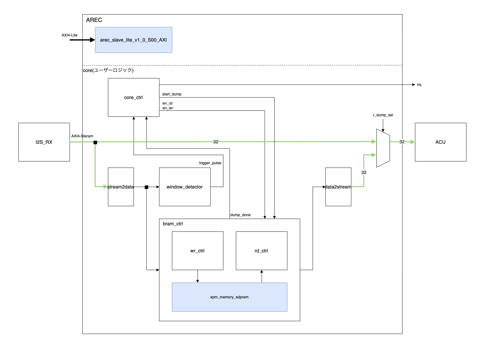

| モジュール名 | 区分 | 役割 |
|---|---|---|
| arec.v | Vivado自動生成ベース | AXI4-LiteラッパおよびAXI4-Stream入出力のTOP |
| arec_slave_lite_v1_0_S00_AXI.v | Vivado自動生成ベース | AXI4-Liteのレジスタ制御 |
| core.v | ユーザー実装 | メイン制御のTOP |
| core_ctrl.v | ユーザー実装 | PASS / ARMED / DUMP の状態制御、IRQ生成、DUMP開始制御 |
| window_detector.v | ユーザー実装 | 窓平均絶対値によるトリガ検出 |
| bram_ctrl.v | ユーザー実装 | BRAMの書き込み/読み出し制御TOP |
| wr_ctrl.v | ユーザー実装 | BRAMへの書き込み制御 |
| rd_ctrl.v | ユーザー実装 | BRAMからの読み出し制御 |
| stream2data.v | ユーザー実装 | AXI4-Streamから内部36bit形式への変換 |
| data2stream.v | ユーザー実装 | 内部36bit形式からAXI4-Streamへの変換 |

内部保存形式（36bit）は「4-3-1. AREC内部保存形式（36bit）」を参照。

#### 8-9-3. 機能詳細
##### 8-9-3-1. 全体制御（割り込み含む）
状態遷移、DUMP開始タイミング、割り込み生成を行う。

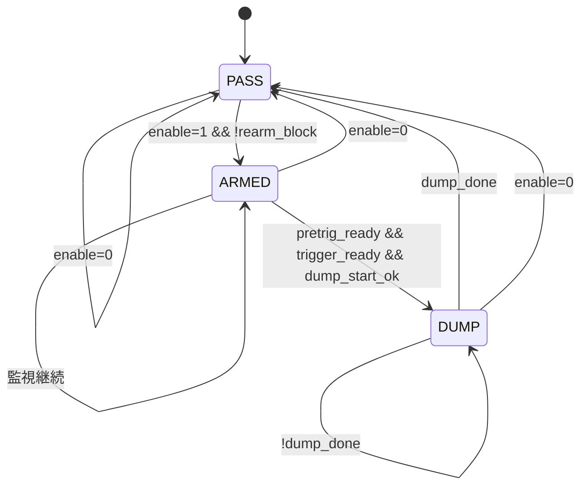
```mermaid
stateDiagram-v2
    [*] --> PASS
    PASS --> PASS: enable=0
    PASS --> ARMED: enable=1 && !rearm_block
    ARMED --> PASS: enable=0
    ARMED --> ARMED: 監視継続
    ARMED --> DUMP: pretrig_ready && trigger_ready && dump_start_ok
    DUMP --> DUMP: !dump_done
    DUMP --> PASS: dump_done
    DUMP --> PASS: enable=0
```

| 状態 | 説明 |
|---|---|
| PASS | 入力AXI4-Streamをそのまま下流へ流す通常状態。AREC内部の監視、BRAM書き込み、BRAM読み出しは停止する |
| ARMED | 入力を受け続けながら音量監視を行い、同時にプリトリガデータをBRAMへ蓄積する待機状態 |
| DUMP | 上流を停止し、BRAMに蓄積したプリトリガデータを読み出して AXI4-Stream出力へ切り替える状態 |

core_ctrlの具体的な制御内容:
1. `enable=1` で `PASS` から `ARMED` へ遷移し、`en_stream2data=1` と `en_wr=1` を有効化する
2. `ARMED` 中は `i2s_tready=1` を維持し、入力を止めずに音量監視とプリトリガ蓄積を進める
3. トリガが先に成立した場合は `r_trigger_flg` に保持し、`pretrig_ready=1` になるまで待つ
4. `pretrig_ready=1` かつ `dump_start_ok=1` のタイミングで `cap_start_ptr` を1クロック出力し、DUMP開始アドレス計算用の `wr_ptr` を確定する
5. DUMP遷移時に `irq` を1クロック出力する
6. DUMP状態へ入ると `i2s_tready=0`、`en_rd=1` に切り替え、BRAM読み出しを優先する
7. DUMP先頭で `start_dump` を1クロック出力し、`rd_ctrl` の読み出しシーケンスを開始させる
8. `dump_done=1` で `PASS` に戻り、`rearm_block` をセットする
9. 再度 `ARMED` に入るには、一度 `enable=0` を書いて `rearm_block` を解除する必要がある

割り込み仕様:
- `irq` は DUMP遷移条件成立時にアサートされる
- `irq_clear` 入力は AXI-Lite `CONTROL[1]` 書き込みで生成される

##### 8-9-3-2. 音量監視
窓平均絶対値と連続成立窓数でトリガ判定を行う。

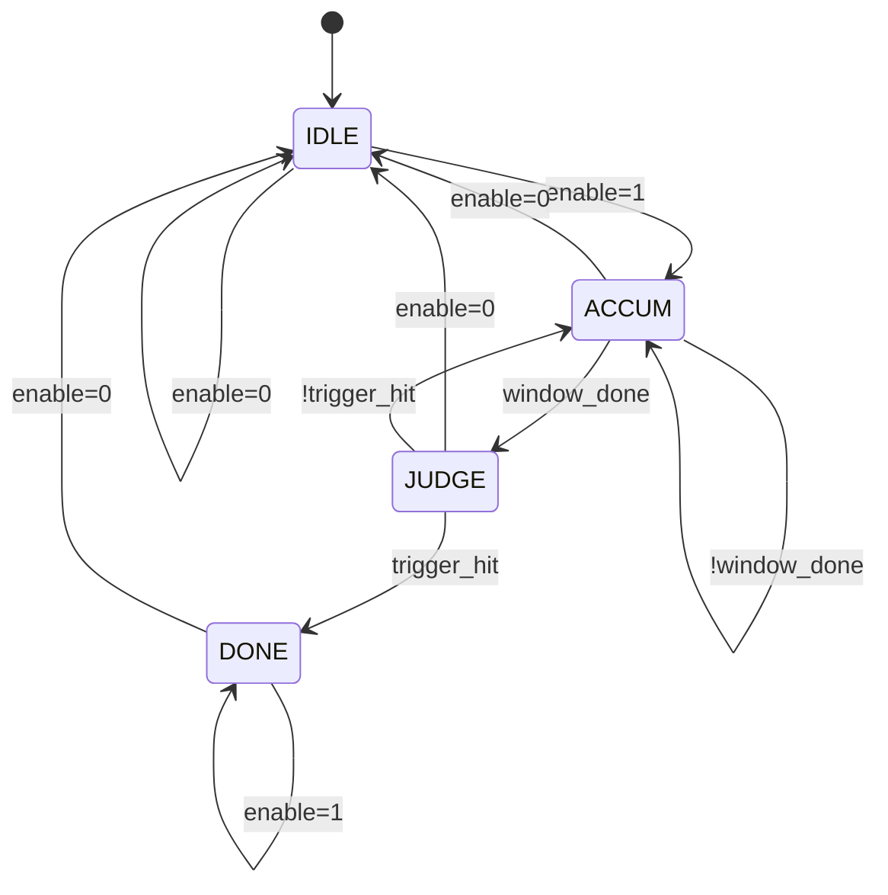
```mermaid
stateDiagram-v2
    [*] --> IDLE
    IDLE --> IDLE: enable=0
    IDLE --> ACCUM: enable=1
    ACCUM --> IDLE: enable=0
    ACCUM --> ACCUM: !window_done
    ACCUM --> JUDGE: window_done
    JUDGE --> IDLE: enable=0
    JUDGE --> ACCUM: !trigger_hit
    JUDGE --> DONE: trigger_hit
    DONE --> DONE: enable=1
    DONE --> IDLE: enable=0
```

| 状態 | 状態の説明 |
|---|---|
| IDLE | `enable=1` を待つ初期状態。積算値、窓カウンタ、連続成立窓数を初期化する |
| ACCUM | `sample_stb` ごとにサンプル絶対値を加算し、1窓分のデータを蓄積する |
| JUDGE | 1窓分の平均絶対値をしきい値と比較し、連続成立窓数を更新する |
| DONE | トリガ成立後の保持状態。`enable=0` になるまで再判定しない |

監視処理の流れ:
1. `IDLE` では `enable=1` を待ちながら、積算値と各種カウンタを初期化する
2. `ACCUM` では `sample_stb=1` のサイクルだけ `sample16` の絶対値を積算する
3. 窓終端 (`window_done=1`) になると `JUDGE` へ遷移し、`mean_abs = (sum_abs + abs_sample) >> window_shift` を計算する
4. `mean_abs >= threshold` なら連続成立窓数を加算し、未満なら連続成立窓数を `0` に戻す
5. 連続成立窓数が `required_windows` に達した場合は `trigger_pulse=1` を出力し、`triggered_latched=1` を保持して `DONE` へ遷移する
6. 条件未達なら `ACCUM` に戻って次の窓を監視する
7. `DONE` では再判定を行わず、`enable=0` で `IDLE` に戻る

##### 8-9-3-3. プリトリガ書き込み
ARMED中の入力サンプルをリングバッファへ連続保存する。

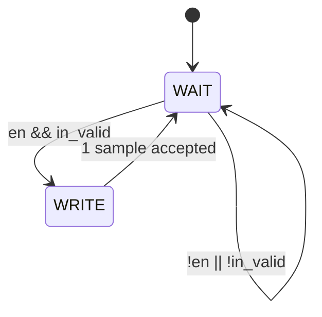
```mermaid
stateDiagram-v2
    [*] --> WAIT
    WAIT --> WAIT: !en || !in_valid
    WAIT --> WRITE: en && in_valid
    WRITE --> WAIT: 1 sample accepted
```

| 状態 | 説明 |
|---|---|
| WAIT | `en` と `in_valid` の成立を待つ待機状態 |
| WRITE | 受理した1サンプルをBRAMへ書き込み、`wr_ptr` を更新する状態 |

書き込み動作:
- `ARMED` 中は `en_wr=1` となり、AXI4-Streamを毎サイクルBRAMへ書き込む
- 書き込みポインタ `wr_ptr` は 2048 深さのリングバッファとして動作し、末尾到達時は `0` に巻き戻る
- `in_ready` は `ARMED` 中常時 `1` であり、AREC内部ではプリトリガ蓄積中にバックプレッシャをかけない

書き込み処理の流れ:
1. `en && in_valid` 成立で1サンプル受理を行う
2. 受理サンプルを内部36bit形式でBRAM書き込みデータへ取り込む
3. 現在の `wr_ptr` を書き込みアドレスとして使用する
4. 書き込み後に `wr_ptr` をインクリメントし、末尾到達時は `0` へ巻き戻す

プリトリガ長:
- `pretrig_samples_reg[11:0]` を読み出し長の基準値として使う
- `0` 指定時は `1`、`2048` 超過時は `2048` に補正する
- 左右チャネルのペアを分断しないため、内部では奇数値を偶数長へ補正する
  - `1` は `2` に補正
  - それ以外の奇数値は `1` 減算して偶数化

##### 8-9-3-4. プリトリガ読み出し
開始位置から `dump_len` 分のデータを順次出力する。

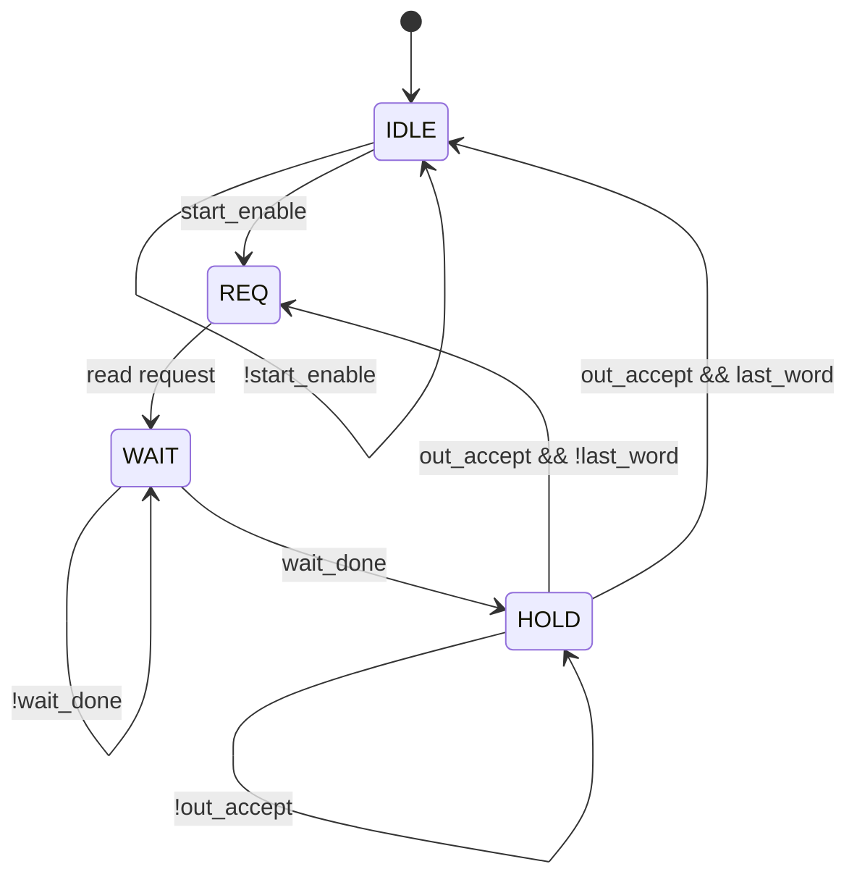
```mermaid
stateDiagram-v2
    [*] --> IDLE
    IDLE --> IDLE: !start_enable
    IDLE --> REQ: start_enable
    REQ --> WAIT: read request
    WAIT --> WAIT: !wait_done
    WAIT --> HOLD: wait_done
    HOLD --> HOLD: !out_accept
    HOLD --> REQ: out_accept && !last_word
    HOLD --> IDLE: out_accept && last_word
```

| 状態 | 状態の説明 |
|---|---|
| IDLE | `start_dump` を待つ待機状態。読み出し開始時に `start_ptr` と `dump_len` を取り込む |
| REQ | BRAMへ読み出し要求を出す状態。`bram_re=1` になる |
| WAIT | BRAMの読み出しレイテンシ待ち状態 |
| HOLD | 読み出した1語を保持し、`out_ready=1` で下流へ受け渡す状態 |

開始位置の決定:
- `cap_start_ptr` 立ち上がり時点の `wr_ptr` を基準に `start_ptr = wr_ptr - dump_len` をリング補正付きで計算する
- 読み出し開始位置は左チャネル境界に合わせるため偶数アドレスへ整列する

読み出し動作:
- `start_dump` 入力で読み出しを開始する
- BRAMは1クロックの読み出しレイテンシを持ち、`REQ -> WAIT -> HOLD` の順で1ワードずつ出力する
- `dump_len` 分のデータを順次 `data2stream` に渡し、最後の1語が `out_valid && out_ready` で受理されたとき `dump_done` を1クロック出力する
- DUMP中は `i2s_tready=0` となり、上流入力を停止させる

##### 8-9-3-5. IF変換
AXI4-Streamと内部36bit形式の相互変換を行う。

`stream2data`:
- AXI4-Streamのハンドシェイク成立を `sample_stb` として出力する
- `tdata` と `tid` を36bitの内部形式へパックする（形式は「4-3-1. AREC内部保存形式（36bit）」）
- 音量監視用サンプルとして `tdata[27:12]` を切り出す（ビット割り当ては「4-3. AXI4-Streamデータフォーマット」）

`data2stream`:
- BRAM読み出しデータをAXI4-Stream形式へ戻す
- 1ワードの内部バッファを持ち、`m_axis_tready` に応じて `tvalid` を保持する
- DUMP中のみ `in_ready` を有効にし、下流が停止してもデータを欠落させない

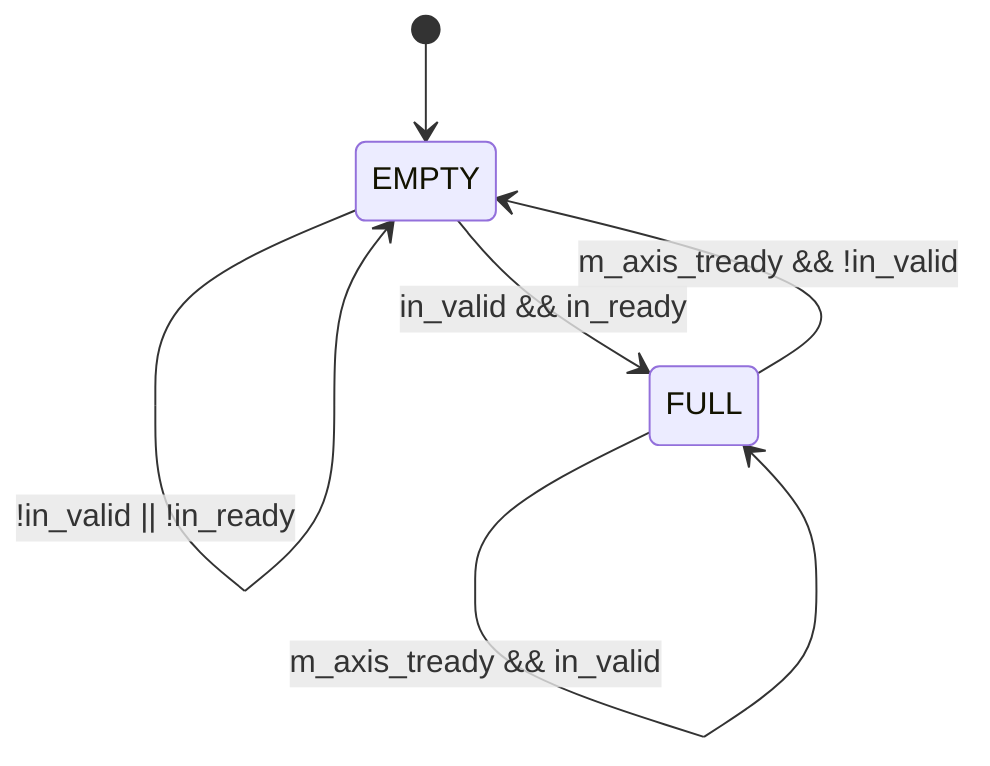
```mermaid
stateDiagram-v2
    [*] --> EMPTY
    EMPTY --> EMPTY: !in_valid || !in_ready
    EMPTY --> FULL: in_valid && in_ready
    FULL --> FULL: !m_axis_tready
    FULL --> EMPTY: m_axis_tready && !in_valid
    FULL --> FULL: m_axis_tready && in_valid
```

| 状態 | 説明 |
|---|---|
| EMPTY | 出力バッファ空状態。受理可能なら新規入力を取り込む |
| FULL | 出力バッファ保持状態。`m_axis_tready` 成立まで `tvalid` を保持する |

IF変換処理の流れ:
1. `stream2data` が AXI4-Stream 入力を `sample_stb` 起点で取り込み、`{tid,tdata,pad}` の内部形式へ変換する
2. `window_detector` は `tdata[27:12]` を16bitサンプルとして監視に使用する
3. DUMP時は `data2stream` が内部形式を AXI4-Stream へ再展開して出力する
4. `data2stream` は1ワードバッファでバックプレッシャを吸収し、データ欠落を防ぐ

#### 8-9-4. レジスタマップ
ARECの制御はAXI4-Liteで行う。以下に各レジスタを個別に示す。

##### CONTROL Register (`0x00`)
ARECの有効化とIRQクリアを制御するレジスタ。

| Bit | Default Value | Access Type | Description |
|---|---|---|---|
| 31:2 | `0x0000000` | R/W | Reserved（未使用） |
| 1 | `0` | R/W | `irq_clear`。書き込みで1クロックパルス生成 |
| 0 | `0` | R/W | `enable`。`0`: PASS固定、`1`: AREC有効 |

補足:
- `THRESHOLD`、`WINDOW_SAMPLES`、`PRETRIG_SAMPLES`、`REQUIRED_WINDOWS` は `enable=0` で設定することを推奨
- DUMP完了後は `rearm_block` により、再アーム時に `enable=0 -> 1` の再設定が必要

##### STATUS_STATE Register (`0x04`)
状態機械の現在状態と内部ステータスを参照する読み出し専用レジスタ。

| Bit | Default Value | Access Type | Description |
|---|---|---|---|
| 31:19 | `0x0000000` | RO | Reserved（`0`固定） |
| 18:16 | `0x0` | RO | `state_reg`（`0`: PASS, `1`: ARMED, `2`: DUMP） |
| 15:6 | `0x000` | RO | Reserved（`0`固定） |
| 5 | `0` | RO | `pretrig_ready` |
| 4 | `0` | RO | `en_rd` |
| 3 | `0` | RO | `en_wr` |
| 2 | `0` | RO | `is_dump` |
| 1 | `0` | RO | `dump_done`（1クロックパルス） |
| 0 | `0` | RO | `triggered_latched` |

##### THRESHOLD Register (`0x10`)
トリガ判定しきい値（平均絶対値比較）を設定するレジスタ。

| Bit | Default Value | Access Type | Description |
|---|---|---|---|
| 31:16 | `0x0000` | R/W | Reserved（未使用） |
| 15:0 | `0x0000` | R/W | `threshold_reg`（16bit） |

補足:
- `window_detector` の `mean_abs` と比較される
- 値が小さいほどトリガしやすく、大きいほどトリガしにくい

##### WINDOW_SAMPLES Register (`0x14`)
監視窓長をシフト値で設定するレジスタ。

| Bit | Default Value | Access Type | Description |
|---|---|---|---|
| 31:5 | `0x0000000` | R/W | Reserved（未使用） |
| 4:0 | `0x00` | R/W | `window_shift_reg`（窓長 `2^shift`） |

補足:
- 実装上の窓カウンタは16bitのため、`shift=0..15` の使用を推奨
- 値を大きくすると判定は安定するが、反応は遅くなる

##### PRETRIG_SAMPLES Register (`0x18`)
プリトリガ保持長（DUMP長）を設定するレジスタ。

| Bit | Default Value | Access Type | Description |
|---|---|---|---|
| 31:12 | `0x00000` | R/W | Reserved（未使用） |
| 11:0 | `0x000` | R/W | `pretrig_samples_reg` |

補足:
- `0` は内部で `1` として扱う
- `2048` 超は内部で `2048` に飽和
- 奇数は内部で偶数へ補正（`1->2`、`3->2`、`5->4` ...）
- 実効値は BRAM 深さ `2048` 以下

##### REQUIRED_WINDOWS Register (`0x1C`)
しきい値超過の連続成立窓数を設定するレジスタ。

| Bit | Default Value | Access Type | Description |
|---|---|---|---|
| 31:4 | `0x0000000` | R/W | Reserved（未使用） |
| 3:0 | `0x0` | R/W | `required_windows_reg` |

補足:
- `0` は内部で `1` として扱う
- 値を大きくすると誤検出は減るが、トリガまでの時間は長くなる

#### 8-9-5. 運用方法
ARECの運用シーケンスと、代表的な設定例 / 調整時の目安を示す。

##### 8-9-5-1. 運用シーケンス
1. `CONTROL.enable=0` で各パラメータを書き込む
2. `CONTROL.enable=1` で監視を開始する
3. `STATUS_STATE` または `irq` でDUMP開始を検知する
4. DUMP完了後に再度録音待機へ戻す場合は、いったん `CONTROL.enable=0` を書いた後に再度 `1` を設定する

##### 8-9-5-2. 設定値の目安
代表的な設定例を以下に示す。

| 用途 | THRESHOLD | WINDOW_SAMPLES | PRETRIG_SAMPLES | REQUIRED_WINDOWS | 目安 |
|---|---:|---:|---:|---:|---|
| デフォルト | `0x0200` | `6` | `512` | `2` | 検証TBで使用している基準値。平均絶対値が約 1.6% FS を2窓連続で超えると録音開始 |
| やや敏感にしたい場合 | `0x0100` | `6` | `512` | `2` | 小さめの音でも反応しやすい。環境ノイズで誤検出しやすくなる |
| 誤検出を減らしたい場合 | `0x0300` | `6` | `512` | `2` | 比較的大きい音のみで録音開始しやすい |
| 反応を速くしたい場合 | `0x0200` | `5` | `512` | `2` | 窓長が短くなり反応は速いが、短時間ノイズに反応しやすくなる |
| より安定判定したい場合 | `0x0200` | `7` | `512` | `3` | 録音開始まで時間がかかるが、単発ノイズで起動しにくい |

補足:
- `THRESHOLD` は平均絶対値判定のしきい値であり、小さいほどトリガしやすい
- `WINDOW_SAMPLES` と `REQUIRED_WINDOWS` を大きくすると誤検出は減るが、応答は遅くなる

---

## 9. 参考資料

本設計に関連する主要資料を以下に示す。

| No.| 資料名 | ファイル | 発行元 |
|---:|---|---|---|
| 1 | Zynq-7000 TRM | [ug585-Zynq-7000-TRM](https://docs.amd.com/r/en-US/ug585-zynq-7000-SoC-TRM) | AMD |
| 2 | I2S Receiver / Transmitter ユーザーガイド | [pg308-i2s-en-us-1.0](https://docs.amd.com/r/en-US/pg308-i2s) | AMD |
| 3 | Audio Formatter ユーザーガイド | [pg330-audio-formatter](https://docs.amd.com/r/en-US/pg330-audio-formatter) | AMD |
| 4 | AXI GPIO ユーザーガイド | [pg144-axi-gpio](https://docs.amd.com/r/en-US/pg144-axi-gpio) | AMD |
| 5 | AXI IIC ユーザーガイド | [pg090-axi-iic-en-us-2.1](https://docs.amd.com/r/en-US/pg090-axi-iic) | AMD |
| 6 | dToFセンサー ユーザーガイド | [SJ-PM-TF-Luna_A05_Product_Manual](https://en.benewake.com/uploadfiles/2025/04/20250430174515390.pdf) | Benewake |
| 7 | SSM2603 ユーザーガイド | [SSM2603](https://www.analog.com/en/products/ssm2603.html) | アナログ・デバイセズ |
| 8 | VoiceNoteシステム設計書 | [design.md](https://github.com/kiiisy/VoiceNote-System/blob/main/docs/system_design.md) | 自分 |
| 9 | Vivado全体BD図 | [design_1.pdf](./design_1.pdf) | Vivado（自動生成） |

---

## 10. おまけ（合成リソース・消費電力）
### 10-1. 合成/実装リソース使用率

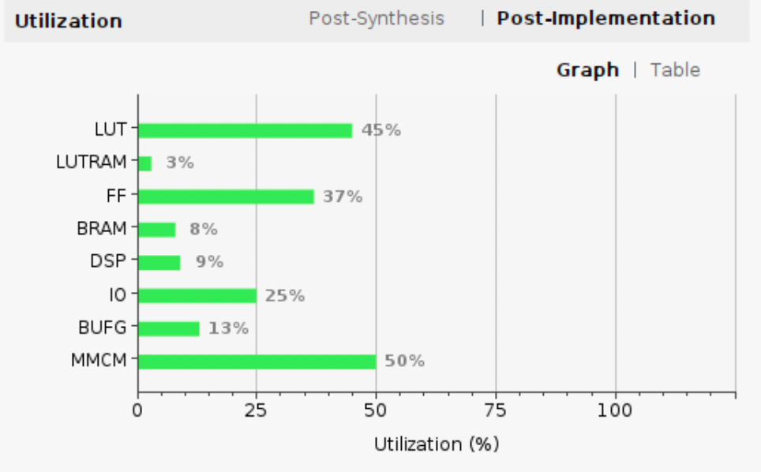


### 10-2. 消費電力

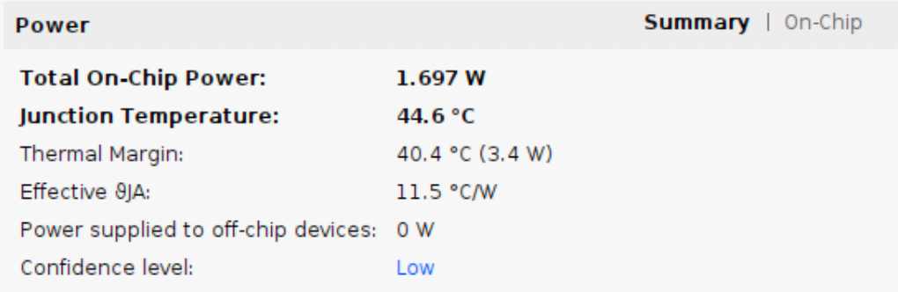

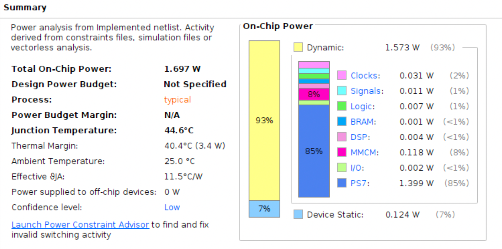
